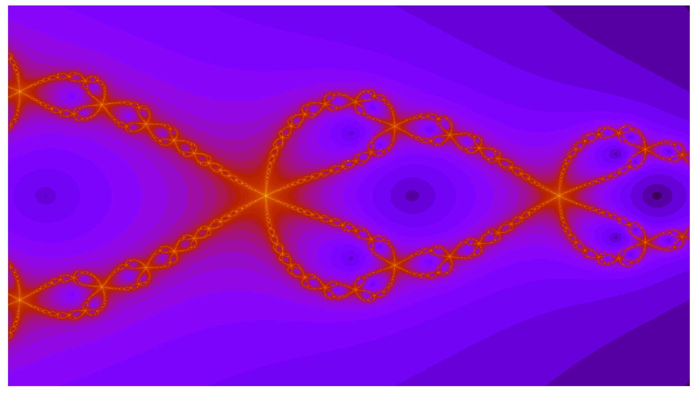

# fraktal

An openmp multithread example in fortran calculating Newtons fractals.

## Use

Type `make` to compile and run the program `fraktal`.

## Number of Threads

By default all available threads are used by the `omp_lib`. However
the number of threads can be set by two means:

1) inside the fortran source code.
    `!$ call omp_set_num_threads( 4 )` 

2) as an environment variable set before executing the program.
    `OMP_NUM_THREADS=16 ./fraktal` 
